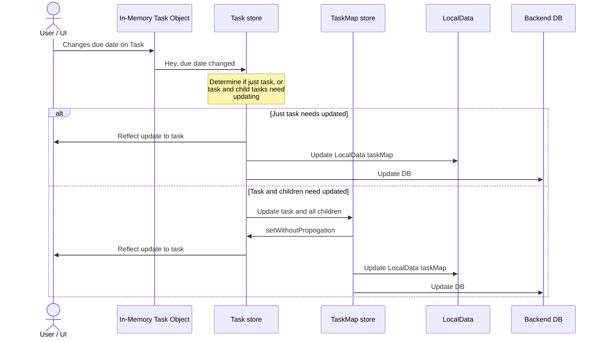
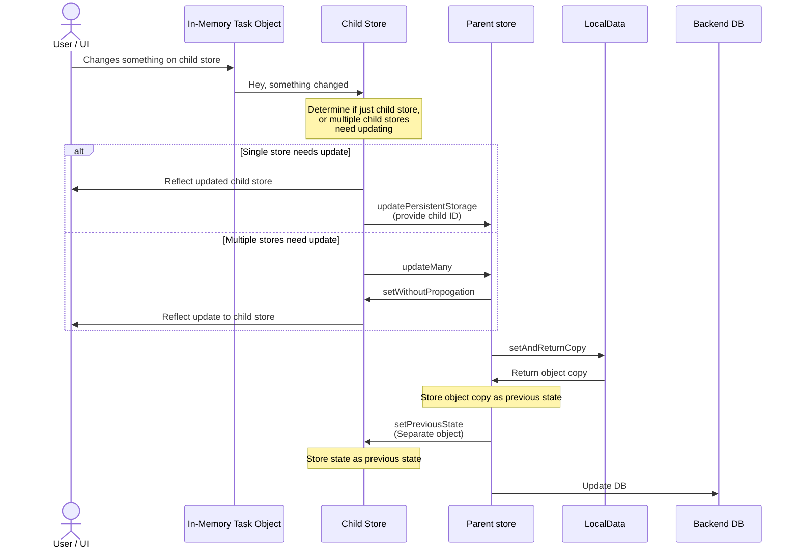

# Personal Dashboard

[](https://app.netlify.com/sites/celadon-kataifi-627143/deploys)

Notes for improvement:

- Filtering + Sorting
  - Filter button at top of list
  - Filter settings per-user
  - Sort at top of list
  - Sort settings per-user
- Task Assignment
- Little things
  - Design for completed tasks
  - Auto-focus the task title when creating a new one
  - Maybe a progress bar for sub-task completion?
- See if it can be made to work offline with [this guide](https://developers.google.com/codelabs/pwa-training/pwa03--going-offline#1)

## General Decisions + Info for Usage

- Recurring Tasks
  - A user can make a task recurring if one of the subtasks is shared. The UI will determine that it can't find the parent recurring task and display that in the recurring info. Because recurring info is shared to all children, each child task will have enough information to display when the next recursion date will happen.

## Architecture

UI Update Flow, using Tasks as an example:



Generic store flow theory:

- A parent store needs to be utilized in the UI
- The parent store contains a variable-length property or object, where each object needs to be watched somewhere in the UI as well



## Developing

To start working on the project simply run:

- `yarn dev` then navigate to the URL it shows in the terminal

Some nice pages to have up at the same time:

- [Svelte Material UI](https://sveltematerialui.com/demo/accordion/)
- [Material Symbols and Icons](https://fonts.google.com/icons?selected=Material+Symbols+Outlined:fitness_center:FILL@0;wght@400;GRAD@0;opsz@24&icon.query=workout)
- [Svelty-Picker](https://mskocik.github.io/svelty-picker) if working with that

### Adding new Material UI Components

To use new Material UI components, add the package needed from [the documentation here](https://sveltematerialui.com/demo/accordion/). Then restart the dev server.

Restarting the dev server is needed whenever the theme is updated in `src/globalStyles/_smui-theme.scss` or a new component is added because it generates the base CSS file (`static/smui.css`) it looks like and makes sure only the CSS needed is compiled.

### Adding new Routes

- Copy an existing route folder and modify

The reason that the `pageInfo.ts` files are separate and not done in the module context is that the module context is only available once the component is loaded for the first time. Because pageInfo is needed everywhere, it needs to be a separate file.

### Logo Adjustment

- [Link to the exact logo that was created](https://prefinem.com/simple-icon-generator/#eyJiYWNrZ3JvdW5kQ29sb3IiOiIjMDAwMDAiLCJib3JkZXJDb2xvciI6IiMwOThlMWYiLCJib3JkZXJXaWR0aCI6IjciLCJleHBvcnRTaXplIjoiMTkyIiwiZXhwb3J0aW5nIjp0cnVlLCJmb250RmFtaWx5IjoiUm9ib3RvIFNsYWIiLCJmb250UG9zaXRpb24iOiI2OCIsImZvbnRTaXplIjoiNTAiLCJmb250V2VpZ2h0Ijo2MDAsImltYWdlIjoiIiwiaW1hZ2VNYXNrIjoiIiwiaW1hZ2VTaXplIjo1MCwic2hhcGUiOiJjaXJjbGUiLCJ0ZXh0Ijoi4pqZ77iPIn0), in case the sizes need to be exported again. This makes it easier to export.

## Building

To create a production version of the app:

```bash
yarn build
```
