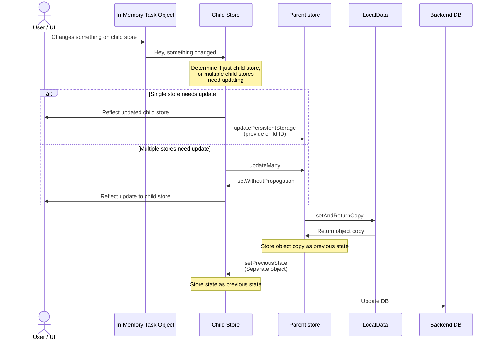

# ⚙️ Personal Dashboard ⚙️

Notes for improvement:

- Little things
  - Fix issue with BSON error once another error comes in
  - Maybe a progress bar for sub-task completion?
- Add JSDoc ESLint configuration
- Add task assignment feature
  - For the task list view, put it under the start date, and highlight in green if it is assigned to the current user
  - For the task details, put "Assigned To" under "Shared With".
    - If the current user is the owner, and the task is already shared, then change the share button to "Assign / Share"
    - If the current user is not the owner, change the share button to "Assign"
    - If the current user is the owner and the task is not shared, the button should stay as "Share"
- Update "Show all children view" for Task List
  - Make it so that it has breadcrumbs to the parent task for each task shown
- Add Activity feature
  - Put the activity dropdown inbetween the "share" + "delete" and done rows but make it hard to tap so it isn't accidentally hit. Actually, just put the drop-down button on the left.
  - Group activity by the last person that made updates over the past day. Still need to think of a data structure to do this but doesn't seem too tough
- See if it can be made to work offline with [this guide](https://developers.google.com/codelabs/pwa-training/pwa03--going-offline#1)

## Overview

### General Decisions + Info for Usage

- Recurring Tasks
  - A user can make a task recurring if one of the subtasks is shared. The UI will determine that it can't find the parent recurring task and display that in the recurring info. Because recurring info is shared to all children, each child task will have enough information to display when the next recursion date will happen.
- Tiered Tag System (or Priority + Location)
  - The result of thinking about this was that there wasn't really a way to do it without making the UI more complicated or ending up in a situation where the user would need to reorder tags on tasks for it to show up correctly.
  - The potential thought was making the order of tags matter to increasingly indent out sections or change the header map result

## Architecture

### Usage of Yarn 4.x

The version of yarn was upgraded to the latest to take advantage of some new features, particularly `yarn patch`, but also to see how the package manager works.

### Singleton Components

Some components are prefixed with `Singleton`, which means that they should only ever be used once. They will export functions to update their content.

### Stores

Generic store flow theory:

- A parent store needs to be utilized in the UI
- The parent store contains a variable-length property or object, where each object needs to be watched somewhere in the UI as well



### Logging

Logging is done via Sentry. Configuration is setup in `hooks.client.ts` primarily.

## Developing

To start working on the project simply run:

- `yarn dev` then navigate to the URL it shows in the terminal

Some nice pages to have up at the same time:

- [Svelte Material UI](https://sveltematerialui.com/demo/accordion/)
- [Material Symbols and Icons](https://fonts.google.com/icons?selected=Material+Symbols+Outlined:fitness_center:FILL@0;wght@400;GRAD@0;opsz@24&icon.query=workout)
- [Svelty-Picker](https://mskocik.github.io/svelty-picker) if working with that
- [Simple Icons](https://simpleicons.org/) if some brand icons are needed

### Adding new Material UI Components

To use new Material UI components, add the package needed from [the documentation here](https://sveltematerialui.com/demo/accordion/). Then restart the dev server.

Restarting the dev server is needed whenever the theme is updated in `src/globalStyles/_smui-theme.scss` or a new component is added because it generates the base CSS file (`static/smui.css`) it looks like and makes sure only the CSS needed is compiled.

### Adding new Routes

- Copy an existing route folder and modify

The reason that the `pageInfo.ts` files are separate and not done in the module context is that the module context is only available once the component is loaded for the first time. Because pageInfo is needed everywhere, it needs to be a separate file.

### Logo Adjustment

- [Link to the exact logo that was created](https://prefinem.com/simple-icon-generator/#eyJiYWNrZ3JvdW5kQ29sb3IiOiIjMDAwMDAiLCJib3JkZXJDb2xvciI6IiMwOThlMWYiLCJib3JkZXJXaWR0aCI6IjciLCJleHBvcnRTaXplIjoiMTkyIiwiZXhwb3J0aW5nIjp0cnVlLCJmb250RmFtaWx5IjoiUm9ib3RvIFNsYWIiLCJmb250UG9zaXRpb24iOiI2OCIsImZvbnRTaXplIjoiNTAiLCJmb250V2VpZ2h0Ijo2MDAsImltYWdlIjoiIiwiaW1hZ2VNYXNrIjoiIiwiaW1hZ2VTaXplIjo1MCwic2hhcGUiOiJjaXJjbGUiLCJ0ZXh0Ijoi4pqZ77iPIn0), in case the sizes need to be exported again. This makes it easier to export.

### Building

To create a production version of the app:

```bash
yarn build
```
